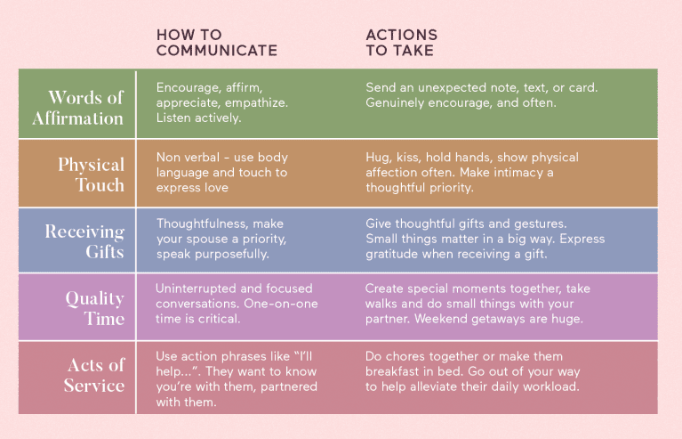

# Web page for the Five Love Languages Test!
### Final Project on the Open Source Software Class 
### Jiyoung Shin 21800409 
### https://youtu.be/OPB6ccH8_dM

## What does this project do?
This project is making a website for the self-test of which users' love language is.

### What is **the Five Love Languages**?


According to Gary Chapman(1992), there are five types of languages that express love including words of affirmations, physical touch, receiving gifts, quality time, acts of service. Also, people have different their own Love Languages, so if you know others' love language, you can make better results in getting close and expressing love to them.

### Why do you need this?
This project and website are for Koreans. Many Korean churches or small communities have used this test for people to get closer to each other, but Korean test site is not easy to be found. Of course, there are many paper tests or data or test sites written in English, they are not enough comfortable to use them for Koreans.

## How to use it?
### If you are a user,
You can visit the site (http://cindy.o-r.kr:3030). If you see the main page, it is working properly, but due to the limit on money spent on maintaining the server, the service may be closed earlier. T T

### If you are a developer,
You can fork or clone this repository and develop it as much as you want, but copyright, please.

## Service Information
- Running on Raspberry Pi B+ (in my home)
- OS: ubuntu 20.04.1 LTS
- Running through Flask web framework. (I love Flask)
- you can find the python library information on requirement.txt (you have to install virtual environment and python libraries in that.)

## Exection
```
python3 -m pip install virtual-env
python3 -m venv venv
./venv/bin/activate
python3 -m pip install -r requirement.txt
python3 app.py
```

## License
- Flask: https://github.com/pallets/flask
- Bootstrap 5.0.1 Bare template: https://github.com/startbootstrap/startbootstrap-bare
- Love Language Test Data: The Five Love Languages: How to Express Heartfelt Commitment to Your Mate, Book by Gary Chapman https://dreamingchurch.net/upload/bbs_file/171203/1390/171203_d_fa5b2d798039ae64145164c4b6f9a615.pdf
- Other: cindy (cinxdys2@gmail.com)